# Evidencias de Ejecución

### Estructura y Tablas en HeidiSQL

* **Árbol de objetos y esquema:**
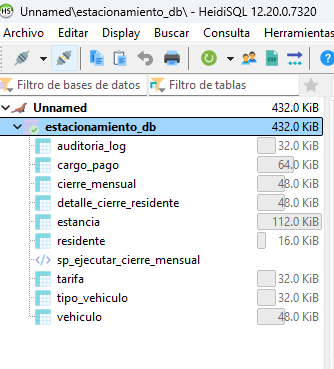

* **Consulta de tablas:**
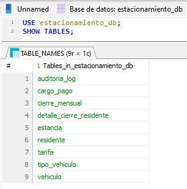

* **Detalle de tablas y conteo de registros:**
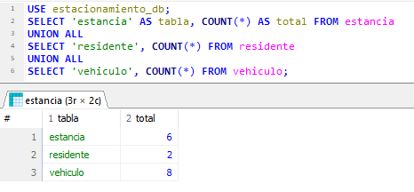

### Ejecución de Consultas SQL y Datos
* **Consulta 1 — Vehículos actualmente dentro del estacionamiento:**
  *Descripción:* Identificación en tiempo real de estancias activas (`fecha_salida IS NULL`).
  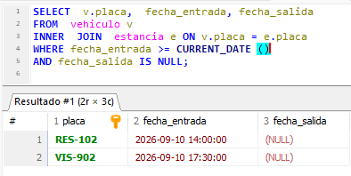

---

* **Consulta 2 — Duración e importe correspondiente a una estancia:**
  *Descripción:* Cálculo dinámico de minutos transcurridos y monto a liquidar según la tarifa del vehículo.
  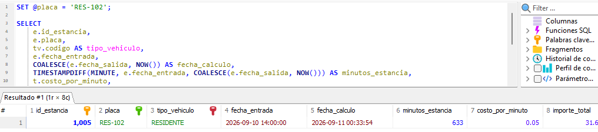

---

* **Consulta 3 — Reporte mensual de residentes:**
  *Descripción:* Consolidación de minutos consumidos, estancias y montos aplicables al periodo del residente.
  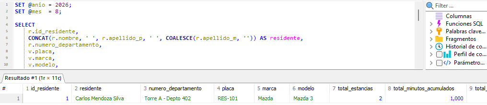

---

* **Consulta 4 — Ingresos por día y por tipo de vehículo:**
  *Descripción:* Agrupación cronológica del flujo de caja por categoría vehicular.
  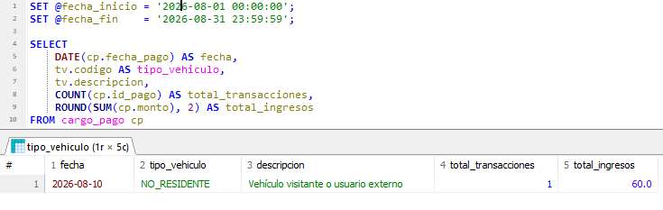

---

* **Consulta 5 — Promedio de permanencia por tipo de vehículo:**
  *Descripción:* Métricas de tiempo promedio (minutos/horas) de estadía por segmento.
  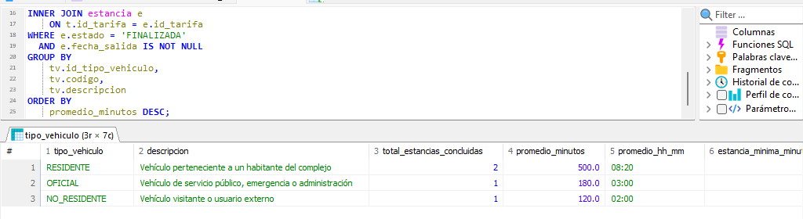

---

* **Consulta 6 — Identificar vehículos con más de una estancia abierta:**
  *Descripción:* Validación de integridad para detectar colisiones de acceso concurrente o salidas no registradas.
  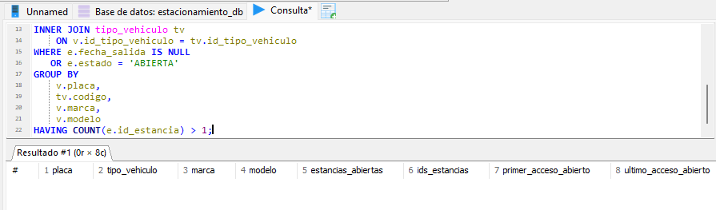

---

* **Consulta 7 — Detectar registros con fechas inconsistentes:**
  *Descripción:* Auditoría de anomalías cronológicas (ej. `fecha_salida < fecha_entrada`).
  *(Validación de consistencia ejecutada; sin registros inconsistentes detectados).*

---

* **Consulta 8 — Vehículos con mayor tiempo acumulado durante el mes:**
  *Descripción:* Top de vehículos con mayor permanencia acumulada en el periodo evaluado.
  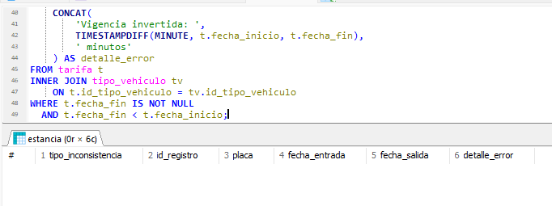

### Procedimiento de Cierre Mensual
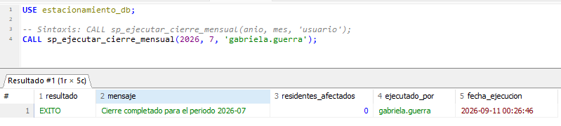

### Evidencias de Ejecución bash: Respaldo, Cifrado y Continuidad Operativa

Documentación de la estrategia de respaldo lógico consistente, compresión, cifrado criptográfico AES-256 y trazabilidad de ejecución:

---

* **1. Ejecución del Script de Respaldo (`ejecucion.png`):**
  *Descripción:* Salida en consola de Git Bash ejecutando el procesamiento por tuberías
  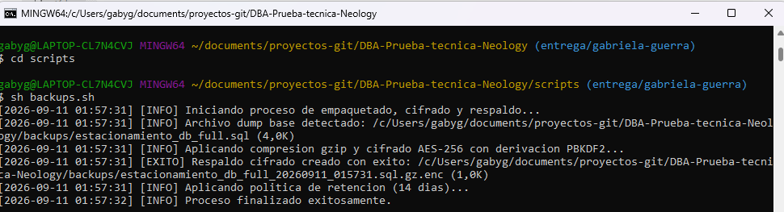

---

* **2. Verificación del Dump (`dump.png`):**
  *Descripción:* Volcado lógico consistente de la base de datos `estacionamiento_db` con estructuras, datos, rutinas y triggers.
  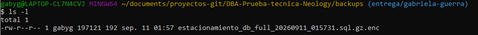

---

* **3. Registro de Auditoría y Logs (`log.png`):**
  *Descripción:* Verificación de la bitácora operacional en `logs/backup_execution.log`, confirmando marcas de tiempo, tamaño y política de retención.
  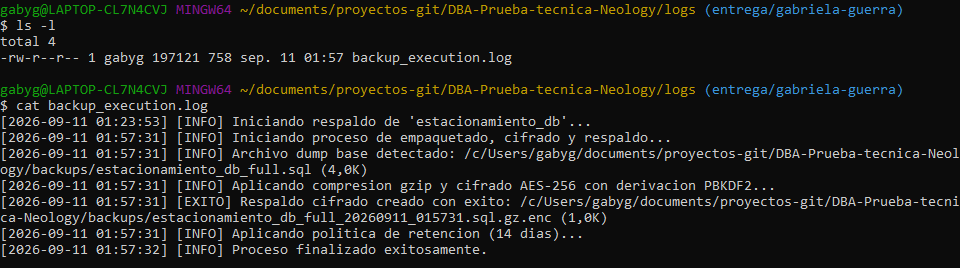