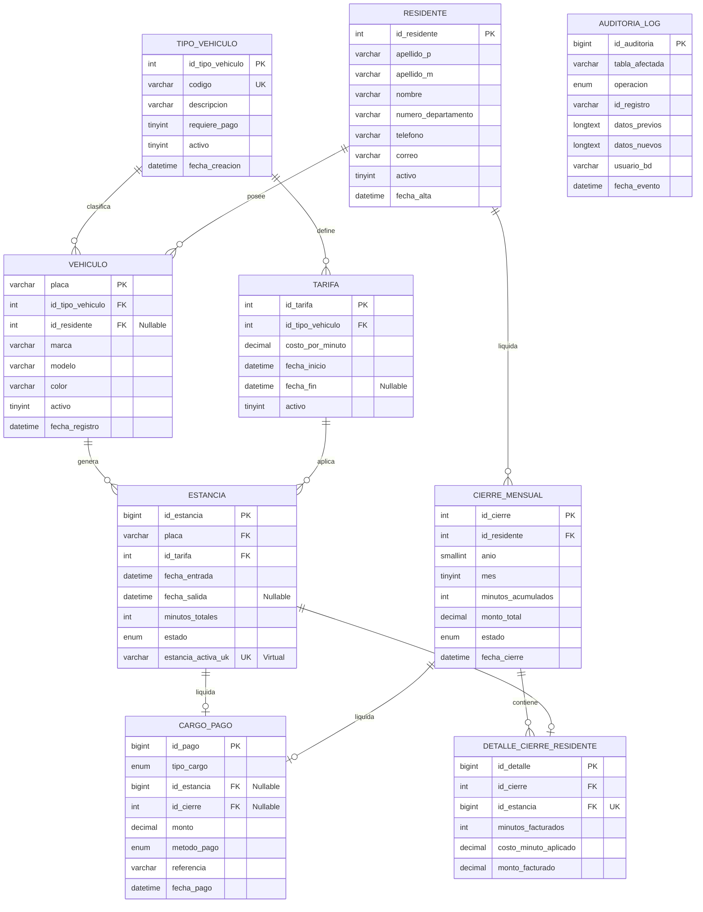

# Modelo de Datos - Sistema de Estacionamiento

## Diagrama Entidad-Relación

```mermaid
erDiagram
    TIPO_VEHICULO ||--o{ VEHICULO : clasifica
    TIPO_VEHICULO ||--o{ TARIFA : define
    RESIDENTE ||--o{ VEHICULO : posee
    VEHICULO ||--o{ ESTANCIA : genera
    TARIFA ||--o{ ESTANCIA : aplica
    ESTANCIA ||--o| CARGO_PAGO : liquida
    RESIDENTE ||--o{ CIERRE_MENSUAL : liquida
    CIERRE_MENSUAL ||--o{ DETALLE_CIERRE_RESIDENTE : contiene
    ESTANCIA ||--o| DETALLE_CIERRE_RESIDENTE : agrupa
    CIERRE_MENSUAL ||--o| CARGO_PAGO : liquida

    TIPO_VEHICULO {
        int id_tipo_vehiculo PK
        varchar codigo UK
        varchar descripcion
        tinyint requiere_pago
        tinyint activo
        datetime fecha_creacion
    }

    RESIDENTE {
        int id_residente PK
        varchar apellido_p
        varchar apellido_m
        varchar nombre
        varchar numero_departamento
        varchar telefono
        varchar correo
        tinyint activo
        datetime fecha_alta
    }

    VEHICULO {
        varchar placa PK
        int id_tipo_vehiculo FK
        int id_residente FK "Nullable"
        varchar marca
        varchar modelo
        varchar color
        tinyint activo
        datetime fecha_registro
    }

    TARIFA {
        int id_tarifa PK
        int id_tipo_vehiculo FK
        decimal costo_por_minuto
        datetime fecha_inicio
        datetime fecha_fin "Nullable"
        tinyint activo
    }

    ESTANCIA {
        bigint id_estancia PK
        varchar placa FK
        int id_tarifa FK
        datetime fecha_entrada
        datetime fecha_salida "Nullable"
        int minutos_totales
        enum estado
        varchar estancia_activa_uk UK "Virtual"
    }

    CARGO_PAGO {
        bigint id_pago PK
        enum tipo_cargo
        bigint id_estancia FK "Nullable"
        int id_cierre FK "Nullable"
        decimal monto
        enum metodo_pago
        varchar referencia
        datetime fecha_pago
    }

    CIERRE_MENSUAL {
        int id_cierre PK
        int id_residente FK
        smallint anio
        tinyint mes
        int minutos_acumulados
        decimal monto_total
        enum estado
        datetime fecha_cierre
    }

    DETALLE_CIERRE_RESIDENTE {
        bigint id_detalle PK
        int id_cierre FK
        bigint id_estancia FK "UK"
        int minutos_facturados
        decimal costo_minuto_aplicado
        decimal monto_facturado
    }

    AUDITORIA_LOG {
        bigint id_auditoria PK
        varchar tabla_afectada
        enum operacion
        varchar id_registro
        longtext datos_previos
        longtext datos_nuevos
        varchar usuario_bd
        datetime fecha_evento
    }
```